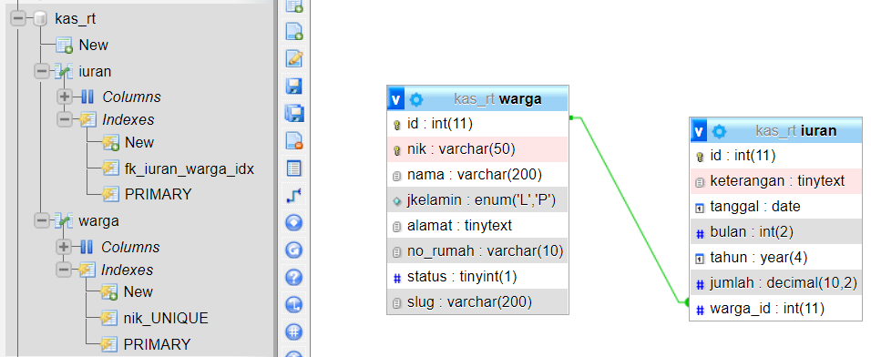
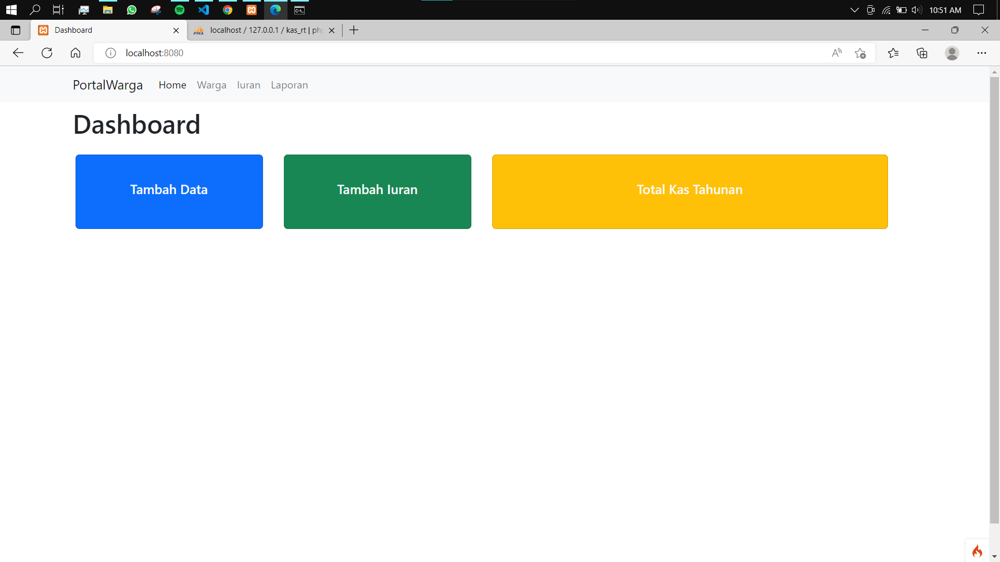

# Aplikasi Iuran Kas

<table border="2" cellpading="10">
  <tr>
    <td><b>Nama</b></td>
    <td>Ilham Nur Utomo</td>
  </tr>
  <tr>
    <td><b>NIM</b></td>
    <td>312010129</td>
  </tr>
  <tr>
    <td><b>Kelas</b></td>
    <td>TI.20.A1</td>
  </tr>
  <tr>
    <td><b>MataKuliah</b></td>
    <td>Pemrograman Web</td>
  </tr>
  <tr>
    <td><b>Dosen Pengampu</b></td>
    <td>Agung Nugroho S.Kom, M.Kom</td>
</table>

- <a href="http://ikasrt.rf.gd"> Demo Aplikasi</a>
- <a href="https://youtu.be/ENExiEyS1Rs"> Dokumentasi Video</a>
- Tampilan Program

  - Database `kas_rt`
    
     
  - Home
  
   
  

